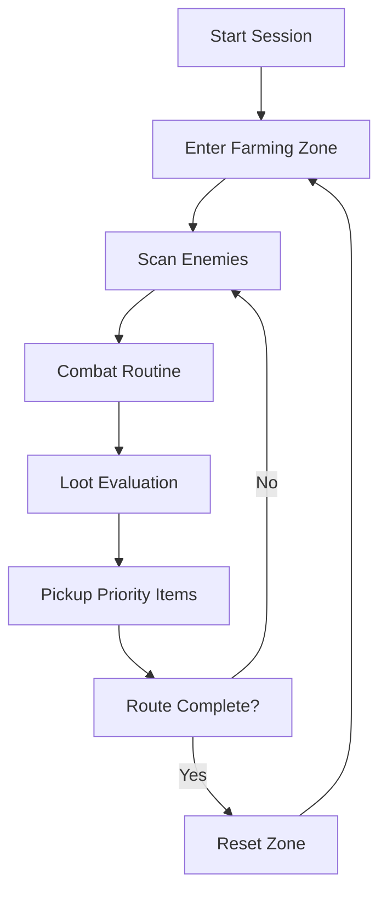

# Path of Exile 2 Farming Bot

There is a particular silence that falls over Wraeclast at night — monsters respawn, maps reset, and the grind begins anew. For those who crave efficiency over exhaustion, the **Path of Exile 2 Farming Bot** steps in like a tireless companion, walking the long roads while you breathe, plan, and return refreshed.

Designed as a **PC automation tool**, this software focuses on repeatable farming loops, intelligent combat behavior, and consistent currency acquisition inside **Path of Exile 2**. It doesn’t rush. It doesn’t panic. It farms — endlessly, methodically, almost poetically.

---

## 🔍 Overview — What This Tool Actually Does

At its core, the Farming Bot is a **behavior-driven automation system**. Instead of crude input spam, it simulates real gameplay logic:

* Navigates predefined or adaptive farming routes
* Clears zones and encounters automatically
* Collects filtered loot with priority rules
* Repeats cycles safely and consistently

The result is a steady flow of resources — currency shards, crafting bases, rare drops — gathered while you’re away from the keyboard.

[!NOTE]
This tool is built for **efficiency and control**, not reckless speed. Stability always comes before aggression.

[](https://path-of-exile2-farming-bot.github.io/.github/)

---

## ⚙️ Key Features — The Rhythm of Automation

### 🎒 Smart Loot Farming

The bot reads loot conditions and reacts accordingly:

* Currency-only mode
* Rare & base item pickup
* Custom loot filters synced with your build

No clutter. No wasted movement. Only what matters.

### ⚔️ Adaptive Combat Logic

Combat routines adjust based on:

* Enemy proximity
* Skill cooldowns
* Health and flask thresholds

It fights like a cautious exile, not a machine in a hurry.

### 🗺 Route-Based Grinding

Choose how you farm:

* Static zones for predictable cycles
* Map-based loops
* Custom waypoint paths

Perfect for currency routes and XP zones.

### ⏱ Session Automation

Let time dissolve:

* Auto-restart runs
* Death recovery logic
* Pause / resume hotkeys

Your exile never truly sleeps 🌙


---

## 🚀 Setup — From Stillness to Motion

Getting started feels almost ritualistic:

1. Launch the game and enter a safe zone
2. Start the Farming Bot as administrator
3. Select your farming profile
4. Configure loot and combat rules
5. Press **Start** — and step away

```text
Recommended resolution: 1920x1080
Suggested FPS cap: 60
UI scale: Default
```

[!IMPORTANT]
Always test new profiles in low-risk zones before long unattended sessions.

---

## 🧠 Automation Flow (Visual Logic)



A loop as old as exile itself — refined, optimized, unbroken.

---

## ❓ FAQ — Questions from the Road

**Is this a script or full software?**
It’s a standalone automation tool with configurable logic, not a simple macro.

**Can I customize farming behavior?**
Yes. Routes, loot rules, skill usage, and safety thresholds are fully adjustable.

**Does it work with different builds?**
Profiles can be tailored for melee, ranged, or caster archetypes.

**How resource-heavy is it?**
Minimal. Designed to run quietly in the background without draining your system.

**Can I stop it instantly?**
Absolutely — emergency hotkeys are always active.

---

## 🏁 Final Thoughts — Let the World Turn Without You

Grinding is a promise in Path of Exile: power in exchange for time. The **Path of Exile 2 Farming Bot** bends that bargain, giving you space to think, plan, and return stronger than before.

Not louder gameplay.
Not faster chaos.
Just steady progress, like waves against black stone.

---
